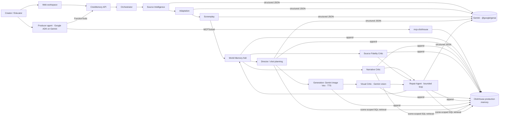

# CineMemory

**The memory & verification layer for agentic filmmaking.**
Built for Google's *Agentic Cinema: The Blockbuster Hackathon*.

CineMemory turns a story into a short film through an orchestrated multi-agent workflow:

`UNDERSTAND → ADAPT → PLAN → GENERATE → INSPECT → DETECT → REPAIR → VERIFY`

The innovation is not "generate AI movies". It is the persistent, structured **world memory** every agent reads from and writes to, the **critics** that check every scene and shot against that memory with evidence, and the **bounded repair loop** that fixes only the component that broke.

### Where it matters: social stories for autistic children

Therapists and parents write **social stories**, first-person step-by-step previews of a situation (a dentist visit, the first day of school) so an autistic child faces no surprises. They only work if every picture shows the same child, the same clothes, the same room and the same order, because inconsistency is what the child will notice. That is precisely what image generators get wrong, so this use has been closed to generative tools.

CineMemory's **social story mode** compiles the adult's words verbatim, locks identity, one outfit, rooms, comfort items and a must-not-show list as constraints, has Gemini compose each picture under those locks, inspects every generated frame with a vision model, regenerates drift, and produces a **Continuity Certificate** the therapist or parent signs before the film reaches the child. Around it: a **child profile** reused by every story (same Maya, same Bun, same Mum, month after month, versioned in ClickHouse), a **child-facing player** driven by the child's sensory profile, photos of the **real rooms** as references, a **plain-language critic**, a **printable booklet**, and an **outcome loop** that feeds the next version. Demo: *Maya goes to the dentist*. Details: [docs/SOCIAL_STORIES.md](docs/SOCIAL_STORIES.md).

---

## Problem

Generative video models produce impressive individual clips and fall apart across many of them: character identity drift, changing clothes, props that vanish, locations and times of day that shift, characters who reference things they cannot know yet, chronology breaks, and required facts that silently disappear from an adaptation. Stuffing the whole screenplay into every prompt does not fix this; it makes prompts huge and still verifies nothing.

## Solution

| Layer | What it does |
|---|---|
| **Production Memory (ClickHouse)** | The long-horizon store. Every scene, shot, state change, knowledge event, constraint, violation, agent action, generation and repair attempt, and evaluation result is appended to ClickHouse through the official Node client. Agents retrieve scene-scoped history from it by SQL instead of re-reading the whole film; the official ClickHouse MCP server gives the Producer agent ad-hoc SQL. **Gemini reasons; ClickHouse remembers.** |
| **World Memory** | Canonical characters, locations, props, events, relationships, knowledge facts, source / visual / continuity constraints, extracted from the source by Gemini and stored with provenance. A deterministic change log records what each scene changes (who learns what, who holds what, where everyone is, how they feel). |
| **Retrieval** | Agents receive a scene-scoped context: character state *at the start of that scene*, facts present characters must not reference yet, and only the constraints in force. Not the whole script. |
| **Critics** | Narrative Continuity, Source Fidelity and Visual Continuity critics produce structured violations (`constraint / expected / observed / severity / confidence / evidence`). Deterministic checks carry confidence 1.0; model-assisted checks must cite evidence a rule can verify (a quote that exists, an image that was inspected). Checks that cannot run are recorded as *not evaluated*, never as passes. |
| **Repair** | Diagnoses the root cause (screenplay, shot prompt, generated media), rewrites or regenerates only the affected component, re-verifies, retries up to a configurable limit, then escalates to the user. |
| **Producer agent (Google ADK)** | A Gemini `LlmAgent` whose tools are CineMemory's real capabilities (run pipeline, inspect status, list violations, query scene memory in ClickHouse, repair, evaluate) plus the ClickHouse MCP toolset. It decides what to run and reports only what tool results say. |
| **CineGraph** | Interactive graph of Character → Scene → Event → Prop → Location → Knowledge → Constraint, including who knows a secret from which scene and who still does not. |
| **Evaluation** | A harness runs the same project as *baseline* (no retrieval, no constraints, no repair) and as *CineMemory*, and computes metrics from the persisted check and violation records of each run. |

Three workflows are supported: **Social story** (an authored routine for an autistic child, compiled verbatim, pictures verified for identity, outfit, setting, comfort items and forbidden content, human sign-off on a Continuity Certificate), **Creator / Filmmaker** (original, public-domain, licensed material, screenplay, idea) and **Kids / Educational** (lesson, concept, facts; required facts become must-keep source constraints that the Source Fidelity Critic verifies in the final screenplay).

## Architecture

```
apps/web        Next.js 16 + Tailwind 4 + React Flow   cinematic workspace (no chatbot)
apps/api        Hono on Node 22                          REST + SSE, job runner, OpenAPI tool surface, Producer agent endpoint
apps/agent      Google ADK (@google/adk)                 Producer LlmAgent on Gemini + CineMemory FunctionTools + ClickHouse MCPToolset
packages/core   TypeScript library                       data model (zod), world memory, ClickHouse production memory,
                                                         agents, critics, repair, orchestrator, media providers, evaluation
```



```
                ┌──────────────┐    ┌────────────┐    ┌────────────┐    ┌──────────────┐
 source text ──▶│ Source Intel │───▶│ Adaptation │───▶│ Screenplay │───▶│ World Memory │──┐
                └──────────────┘    └────────────┘    └────────────┘    │  fold + log  │  │ retrieveSceneContext()
                                                                        └──────────────┘  ▼
                ┌───────────────┐   ┌──────────────┐   ┌───────────────┐   ┌──────────┐  ┌──────────┐
   film  ◀──────│ Film Assembler│◀──│ Visual Critic│◀──│  Generation   │◀──│ Director │◀─┤ Critics  │
                └───────────────┘   └──────────────┘   │(Gemini/Imagen │   └──────────┘  │ narrative│
                          ▲               │            │ Veo / TTS)    │                  │ source   │
                          └── Repair ◀────┴────────────┴───────────────┴──────────────────┤ visual   │
                              (bounded, root-cause targeted, escalates)                   └──────────┘
```

Every agent action is written to an append-only **event log** (`WorkflowEvent`), stored in ClickHouse, and rendered verbatim by the Agent Activity screen. Every Gemini call is instrumented (model, latency, tokens) and stored as an `agent_actions` row; every memory retrieval is logged with the SQL that ran.

Details: [docs/ARCHITECTURE.md](docs/ARCHITECTURE.md) · [docs/GOOGLE_CLOUD.md](docs/GOOGLE_CLOUD.md) · [docs/PARTNER_INTEGRATION.md](docs/PARTNER_INTEGRATION.md) (ClickHouse + MCP) · [docs/AGENTS.md](docs/AGENTS.md) · [docs/DATA_MODEL.md](docs/DATA_MODEL.md) · [docs/DEMO.md](docs/DEMO.md) · [docs/STATUS.md](docs/STATUS.md) (what has actually executed)

## Setup

Requirements: Node ≥ 22.13 (uses the built-in `node:sqlite`), pnpm 10, Python 3 (for the local ClickHouse engine and the ClickHouse MCP server).

```bash
pnpm install                  # also builds packages/core and apps/agent (postinstall)
cp .env.example .env          # 1) GEMINI_API_KEY  2) CLICKHOUSE_URL (+ user/password)
```

After a `git pull` that changes `packages/core` or `apps/agent`, run `pnpm build:libs` (or `pnpm install`) before `pnpm dev:api`, otherwise the API loads a stale build and fails with a missing-export error.

**Where to put the Gemini key:** in `.env` at the repository root, as `GEMINI_API_KEY=AIza...` (create the key at <https://aistudio.google.com/apikey>). The API reads `.env` from the repo root on start; on Cloud Run set the same name as an environment variable or secret. `.env` is git-ignored; never commit it.

**ClickHouse:** production uses ClickHouse Cloud (`CLICKHOUSE_URL=https://<host>.clickhouse.cloud:8443`, `CLICKHOUSE_USER`, `CLICKHOUSE_PASSWORD`). For local development without Docker: `pip install chdb`, then `pnpm clickhouse:local` and `CLICKHOUSE_URL=http://127.0.0.1:8123`. Without `CLICKHOUSE_URL` the API falls back to local (non-persistent) memory and says so in the UI.

### Environment variables

| Variable | Purpose |
|---|---|
| `GOOGLE_OAUTH_CLIENT_ID` | optional; enables "Continue with Google" in the family app (local email/password accounts work without it) |
| `GEMINI_API_KEY` | Google AI Studio key. Enables live Gemini agents, Gemini/Imagen keyframes, Gemini TTS, Gemini vision inspection. |
| `GOOGLE_GENAI_USE_VERTEXAI`, `GOOGLE_CLOUD_PROJECT`, `GOOGLE_CLOUD_LOCATION` | Use Vertex AI with Application Default Credentials instead of an API key. |
| `LLM_PROVIDER` | `gemini` (default when a key is present) or `fixture` (development replay for the bundled demo only). |
| `GEMINI_TEXT_MODEL` | default `gemini-3.6-flash` |
| `MEDIA_PROVIDER` | `gemini` or `placeholder` (labelled SVG storyboard cards, no video/audio). |
| `GEMINI_IMAGE_MODEL`, `GEMINI_VIDEO_MODEL`, `GEMINI_TTS_MODEL` | defaults `gemini-3.1-flash-image`, `veo-3.1-fast-generate-preview`, `gemini-2.5-flash-preview-tts`. An `imagen-*` image model switches to the Imagen API. |
| `FFMPEG_PATH` | optional; ffmpeg binary for the MP4 render (auto-detected on PATH or from `pip install imageio-ffmpeg`) |
| `ENABLE_VIDEO_GENERATION` | `true` to call Veo (billable, slow). Keyframes and voice are generated regardless. |
| `CINEMEMORY_DATA_DIR` | SQLite database + media directory (default `./data`). |
| `REPAIR_MAX_ATTEMPTS` | Repair retries per violation before escalation (default 2). |
| `CLICKHOUSE_URL`, `CLICKHOUSE_USER`, `CLICKHOUSE_PASSWORD`, `CLICKHOUSE_DATABASE` | ClickHouse production memory (ClickHouse Cloud or server; `http://127.0.0.1:8123` for the local engine). |
| `PARTNER_ADAPTER` | `clickhouse` (default when `CLICKHOUSE_URL` is set) or `local` (development only). |
| `CINEMEMORY_MCP` | set `false` to run the Producer agent without the ClickHouse MCP toolset. |
| `API_PORT`, `NEXT_PUBLIC_API_URL` | API port (default 8787) and the URL the web app calls. |

### Google Cloud setup

1. Create a project and enable the **Generative Language API** (AI Studio key) or **Vertex AI API** (ADC).
2. For AI Studio: create a key at <https://aistudio.google.com/apikey> and set `GEMINI_API_KEY`.
3. For Vertex AI: `gcloud auth application-default login`, then set `GOOGLE_GENAI_USE_VERTEXAI=true`, `GOOGLE_CLOUD_PROJECT`, `GOOGLE_CLOUD_LOCATION`.
4. Veo and Imagen require billing; keep `ENABLE_VIDEO_GENERATION=false` until you want clips.
5. Deploy: `deploy/Dockerfile.api` and `deploy/Dockerfile.web` are Cloud Run-ready (the API reads `PORT`; mount a volume or use Cloud Storage FUSE at `/data`).
6. Agent Builder / Gemini Enterprise / Agent Engine: see [docs/GOOGLE_CLOUD.md](docs/GOOGLE_CLOUD.md). The Producer is a standard ADK agent; the API also publishes `GET /api/openapi.json` for OpenAPI tool registration.
7. `pnpm gemini:smoke` (add `--video` for Veo) verifies every live model path with your quota and reports exactly which service/model fails.

## How to run

```bash
pnpm clickhouse:local                  # local ClickHouse engine on :8123 (or use ClickHouse Cloud)
pnpm dev:api                           # http://localhost:8787
pnpm dev:web                           # http://localhost:3000
pnpm demo:seed                         # create the demo project and run it to "narrative_verified" from the CLI
pnpm eval                              # baseline vs CineMemory on the demo project
pnpm gemini:smoke                      # verify live Gemini / image / vision / TTS (add --video for Veo)
pnpm --filter @cinememory/agent chat   # talk to the ADK Producer agent in the terminal
pnpm test                              # core 31 (incl. ClickHouse integration) + api 4 + agent 2
```

Without a Gemini key the API starts in **development mode**: the bundled demo project runs against authored fixtures (stamped `provider: "fixture"` everywhere, with a banner in the UI), keyframes are labelled placeholder cards, the Producer agent reports that it needs a key, and any other project fails loudly instead of pretending. With a key, the same pipeline runs against Gemini. Fixtures are for tests and development only.

## Demo workflow

1. Open the dashboard → **Create demo project** ("Lumi and the Broken Compass", an original story written for this project).
2. **Production**: watch the stages run and the activity log fill with real events (source analyzed, 14 constraints extracted, scene planned, violation detected, repair initiated, scene rewritten, verification passed…).
3. **Continuity**: the critics catch `KNOWLEDGE_TIMELINE_VIOLATION` (Milo mentions the compass secret in Scene 4 before Lumi tells him in Scene 5) and `REQUIRED_FACT_MISSING` (the bioluminescence fact). Open the evidence, see the repair attempts, or override.
4. **CineGraph**: click the knowledge node to see *Lumi knows: Scene 3 · Milo knows: Scene 5 · Pip: UNKNOWN*.
4b. **Memory**: the ClickHouse page shows the tables for this production, the SQL each agent ran to retrieve scene history, model usage and the knowledge timeline; pick "before scene 4" to see why Milo's line was a violation.
5. **Screenplay**: open "retrieved memory" on Scene 4 to see exactly what agents are given for that scene.
6. **Storyboard → Final Film**: generate keyframes, inspect expected vs generated state, play the assembled film with chapters and subtitles.
7. **Evaluation**: run baseline vs CineMemory and inspect the two evaluation projects behind the numbers.

Full walkthrough: [docs/DEMO.md](docs/DEMO.md).

## Limitations

- Live Gemini, Imagen, Veo and TTS calls are implemented with the official `@google/genai` SDK but have not yet been executed from the build environment (no key was available there); `pnpm gemini:smoke` is the first thing to run with your key, and it reports per model which call failed and why.
- Visual media inspection needs a vision-capable provider and model-generated keyframes; otherwise those checks are reported as *not evaluated*.
- The film player sequences clips/keyframes in the browser; a single rendered MP4 requires ffmpeg and a clip for every shot.
- Narrative knowledge checks rely on trigger phrases extracted by the Source Intelligence Agent (deterministic, explainable, but not semantic). A quote-verified Gemini judge backs the Source Fidelity Critic when a key is configured.
- No authentication; single-tenant local deployment.

## Partner integration: ClickHouse

ClickHouse is CineMemory's production memory and analytics store, accessed through the official `@clickhouse/client` and the official `mcp-clickhouse` MCP server. The `PartnerAdapter` contract (`storeEvent`, `queryEvents`, `storeState`, `retrieveState`, `search`, `emitMetric`, `healthCheck`) and the richer `ProductionMemory` contract are both implemented by `ClickHouseMemory`. Tables, retrieval queries, and the knowledge-timeline demonstration are documented in [docs/PARTNER_INTEGRATION.md](docs/PARTNER_INTEGRATION.md).

## Rights

Source material must be original, licensed, or public domain. No copyrighted novels ship in this repository. Generated previews use fictional characters; real actors are never synthesized.

License: MIT.
